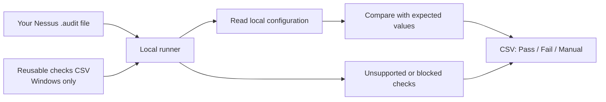

# Local Audit Runner

**Local configuration audits. Clear evidence. CSV results.**

Run supported checks from Nessus `.audit` files directly on the machine you are assessing. Compare actual settings with expected values and export a straightforward **Pass / Fail / Manual** report for review.

A Windows PowerShell runner and a Linux/Unix shell runner share a simple reporting format. The checks come from the audit file you supply. Originally published as `win11-check`.


[Quick start](#quick-start) · [Supported checks](#supported-checks) · [Results](#reading-the-results) · [Options](#runner-options) · [Development](#development)



## What it does

- **Collect local evidence:** inspect supported registry, policy, service, account and Unix configuration checks.
- **Keep results readable:** export the check name, actual value, expected value and outcome in four CSV columns.
- **Reuse Windows check catalogs:** export parsed checks, then run the catalog again without reparsing the original audit file.
- **Surface review work:** retain unsupported checks as `Manual` instead of silently dropping them.
- **Control embedded execution:** PowerShell and shell commands supplied by audit files require an explicit opt-in.

This is an independent local runner with partial Nessus audit-format support. It does not implement the full Nessus evaluation engine, and a passing report does not establish complete benchmark compliance. No benchmark files are bundled.

## Quick start

Clone the repository, then supply an audit file appropriate for the target machine:

```sh
git clone https://github.com/EthanChamps/local-audit-runner.git
cd local-audit-runner
```

### Windows

Use Windows PowerShell on the machine being assessed. Run an elevated session when reading protected security or audit policies; insufficient access can result in `Manual` rows with error details.

```powershell
.\Invoke-NessusAudit.ps1 -AuditPath C:\Audits\benchmark.audit -OutputPath .\results.csv
```

Open `results.csv` in Excel or another CSV viewer. The output folder must already exist. Without `-OutputPath`, results are written beside the PowerShell script as `<input>_results_<timestamp>.csv`.

The runner uses Windows facilities such as the registry, `secedit.exe` and `auditpol.exe`; run it on the Windows target, not inside a Linux shell.

### Linux / Unix

Use a Unix shell with `awk`, `grep`, `sed`, `tr` and standard system utilities. Individual checks also depend on host tools such as the package manager, `pgrep` or `systemctl`.

```sh
sh ./invoke-nessus-audit.sh /path/to/benchmark.audit -o ./results.csv
```

Without `-o`, results are written in the current directory as `<input>_results_<timestamp>.csv`. Available checks depend on the operating system, installed tools and the permissions of the account running the script.

## Supported checks

These are implemented mappings, not a guarantee of support for every field or variation of each audit item.

| Area | Windows / PowerShell | Linux / Unix |
| --- | --- | --- |
| Registry | Registry settings, GUID PolicyManager settings and registry-backed banners | — |
| Account policy | Password and account lockout policy | — |
| Privileges and auditing | User rights and audit-policy subcategories | — |
| Accounts and services | Built-in account checks and service policies | Service enabled/active checks |
| Files | — | Common file existence and content checks |
| Packages and processes | — | Package installed and process running checks |
| Embedded code | PowerShell, explicitly enabled | Shell commands, explicitly enabled |
| Unmapped checks | Retained as `Manual` | Retained as `Manual` |

For Unix checks, existing files have ownership/mode details collected for manual review; missing files fail. Package checks inspect installation, and service checks inspect enabled/active state; these are narrower than complete package-version or service-policy evaluation.

## Reading the results

The CSV has four columns:

| CHECK | Actual Value | Expected Value | Pass/Fail/Manual |
| --- | --- | --- | --- |
| 1.1 Example setting | 1 | 1 | Pass |
| 1.2 Example setting | 0 | 1 | Fail |
| 1.3 Example unsupported check | Unsupported Nessus audit item type for this local runner: EXAMPLE_TYPE | Manual review required | Manual |

*Illustrative rows showing the output format, not results from a real device or a bundled benchmark.*

| Outcome | Meaning | Next step |
| --- | --- | --- |
| **Pass** | The runner's comparison matched the expected value. | Confirm the check and its interpretation fit the assessment. |
| **Fail** | The comparison did not match. | Review the evidence and the target's intended configuration. |
| **Manual** | The check was unsupported, blocked, could not be evaluated, or requires review. | Read `Actual Value` for the reason and verify separately. |

Successful script completion means results were exported. Inspect the CSV to determine whether checks passed; do not use process completion as a compliance verdict.

## Runner options

### Windows

| Parameter | Purpose |
| --- | --- |
| `-AuditPath` | Parse and run a Nessus `.audit` file. |
| `-ChecksPath` | Run a previously exported checks catalog CSV. |
| `-OutputPath` | Set the results CSV path. |
| `-ExportChecksPath` | Save the parsed catalog before running the checks. This is not a parse-only mode. |
| `-AllowEmbeddedScripts` | Allow embedded PowerShell from a trusted input. |

Supply either `-AuditPath` or `-ChecksPath`. If both are supplied, the audit file takes precedence.

Export a reusable catalog and results:

```powershell
.\Invoke-NessusAudit.ps1 -AuditPath C:\Audits\benchmark.audit -ExportChecksPath .\benchmark_checks.csv -OutputPath .\results.csv
```

Run the catalog later:

```powershell
.\Invoke-NessusAudit.ps1 -ChecksPath .\benchmark_checks.csv -OutputPath .\results.csv
```

The legacy entrypoint remains available:

```powershell
.\Invoke-CISWindows11Audit.ps1 -AuditPath C:\Audits\benchmark.audit
```

It forwards audit/checks and output paths to the main runner. Use `Invoke-NessusAudit.ps1` for catalog export or embedded-script options.

### Linux / Unix

| Argument | Purpose |
| --- | --- |
| `AUDIT_FILE` | Path to the Nessus `.audit` file. |
| `-o`, `--output` | Set the results CSV path. |
| `--allow-command-exec` | Allow embedded commands from a trusted audit file. |
| `-h`, `--help` | Show usage. |

### Embedded scripts and commands

Embedded execution is disabled by default. Review the input before enabling it: embedded code runs with your account's permissions and may change the system or access the network.

```powershell
.\Invoke-NessusAudit.ps1 -AuditPath C:\Audits\trusted.audit -AllowEmbeddedScripts
```

```sh
sh ./invoke-nessus-audit.sh /path/to/trusted.audit --allow-command-exec
```

## Data handling

The runners evaluate the local machine and write results to local CSV files. Treat audit inputs, reusable catalogs and reports as assessment material; they may reveal configuration details or contain embedded commands.

The repository ignores `.audit` files and the default catalog/result filename patterns. Custom filenames such as `results.csv` are not covered by those patterns. Keep real assessment outputs outside your checkout when sharing changes.

## Development

Run the existing regression checks from the repository root:

```powershell
.\tests\Invoke-NessusAudit.Regression.ps1
```

The suite checks Windows parser and comparison behaviour, including AND/OR expressions, user-right principal normalisation and service-policy mapping. It loads functions without running a host audit. It does not validate a complete benchmark or the Unix runner.

| File | Responsibility |
| --- | --- |
| [Invoke-NessusAudit.ps1](Invoke-NessusAudit.ps1) | Windows parser, check evaluation and CSV export |
| [invoke-nessus-audit.sh](invoke-nessus-audit.sh) | Linux/Unix parser, check evaluation and CSV export |
| [Invoke-CISWindows11Audit.ps1](Invoke-CISWindows11Audit.ps1) | Compatibility entrypoint |
| [tests/Invoke-NessusAudit.Regression.ps1](tests/Invoke-NessusAudit.Regression.ps1) | PowerShell regression checks |

[Report a bug or request a mapping](https://github.com/EthanChamps/local-audit-runner/issues) with the operating system, runner, sanitised audit item and expected versus actual result. Share only input excerpts you are permitted to redistribute.

## Licence

No licence is currently included in this repository. Audit files supplied separately remain subject to their own terms.
